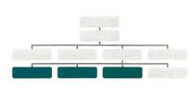

# **Problem Domain, Objects, and the DOM**

## **Understanding The Problem Domain Is The Hardest Part Of Programming**

&nbsp;

## **What is the hardest thing about writing code?**

&nbsp;

**There are many common answers to this question:**

> - Learning a new technology
> - Naming things
> - Testing your code
> - Debugging
> - Fixing bugs
> - Making software maintainable

> - ### **But the single hardest thing about programming is still learning the problem domain.**

&nbsp;

## **Why problem domains are hard**

Writing code is a lot like putting together a `jigsaw puzzle.`  
We put together code with the purpose of building components that we have taken out of the “bigger picture” of the problem domain.
> - `The big issue is that many problem domains are like a puzzle with a blurry picture or no picture at all.`

&nbsp;

## **Programming is easy if you understand the problem domain**

> - The more and more we write code, the more we learn that understanding the problem is the most critical piece to the equation. 
> - It is very difficult to solve a problem before we know the question.  It’s like buzzing in on Jeopardy before we hear the clue and shouting out random questions.

&nbsp;

## **What can you do about it?**
>  ### If understanding the problem domain is the hardest part of programming and we want to make programming easier, `we can do one of two things:`

1. ### Make the problem domain easier.
2. ### Get better at understanding the problem domain.

> #### `We can often make the problem domain easier by cutting out cases and narrowing our focus to a particular part of the problem.`

&nbsp;

> #### `The other choice is to become better at understanding problem domains`

&nbsp;

&nbsp;

## **WHAT IS AN OBJECT?**

> Objects group together a set of variables and functions to create a model
of a something we would recognize from the real world. In an object,
variables and functions take on new names.

> `IN AN OBJECT: VARIABLES BECOME
KNOWN AS PROPERTIES`
&nbsp;

> `IN AN OBJECT: FUNCTIONS BECOME
KNOWN AS METHODS`

&nbsp;

&nbsp;

### `Above you can see a hotel object. The object contains the following key/value pairs:`

|PROPERTIES:|        KEY        |  VALUE   |
| --------- | ----------------  | -------  |
|           |       name        | string   |
|           |      rooms        | number   |
|           |      booked       | number   |
|           |       gym         | Boolean  |
|           |     room Types    | array    |
|METHODS:   | checkAvailability | function |

&nbsp;

## **Creating An Object**

### `Literal Notation`

> Literal notation is the easiest and most popular way to creat objects.

JAVASCRIPT 

`var hotel = {`

`name: 'Quay',`

`rooms : 40,`

`booked: 25,`

`checkAvailability: function() {`

`return this.rooms - this.booked;`

`}`

`} ;`

`var elName = document .getElementByld('hotelName');`

`elName.textContent =hotel .name;`

`var elRooms = document.getElementByid{'rooms');`

`elRooms .textContent = hotel .checkAvailability();`

&nbsp;

| RESULTS |
|-|
||

&nbsp;

&nbsp;

## **DOCUMENT OBJECT MODEL (DOM)?**

&nbsp;

`The Document Object Model (DOM) specifies how browsers should create a model of an HTML page and how JavaScript can access and update the contents of a web page while it is in the browser window.`

#### The DOM is neither part of HTML, nor part of JavaScript; it is a separate set of rules. It is implemented by all major browser makers, and covers two primary areas:

1. Making a Model of the HTML page.
2. Accesssing and Changing the HTML page.

&nbsp;

## **THE DOM TREE IS A MODEL OF A WEB PAGE**
> As a browser loads a web page, it creates a model of that page.
The model is called a DOM tree, and it is stored in the browsers' memory.
It consists of four main types of nodes.

&nbsp;
`Each node is an object with methods and properties. Scripts access and update this DOM tree (not the source HTML file). Any changes made to the DOM tree are reflected in the browser.`

&nbsp;

&nbsp;

## **WORKING WITH THE DOM TREE**

### Accessing and updating the DOM tree involves two steps:

> 1. Locate the node that represents the element you want to work with.
> 2. Use its text content, child elements, and attributes.

&nbsp;

## **STEP 1: ACCESS THE ELEMENTS**

## A.
>  Select and individual element node.

### Here are three common ways to select an individual element:

`get El ement Byld ()`

Uses the value of an element's
id attribute (which should be
unique within the page).

`querySe 1 ector ()`

Uses a CSS selector, and returns
the first matching element.

You can also select individual
elements by traversing from one
element to another within the
DOM tree (see Traversing between element nodes).

&nbsp;

## B.
>  Select multipleelements (Nodelists)

### There are three common ways to select multiple elements.

`getElementsByClassName()`

Selects all elements that have a specific value for their class attribute.

`getElementsByTagName()`

Selects all elements that have the specified tag name ..

`querySelectorAll()`

Uses a CSS selector to select all matching elements.

## C.
>  Traversing between element nodes

### You can move from one element node to a related element node. 

`parentNode`

Selects the parent of the current element node (which will return just one element).

`previousSibling / nextSibling`

Selects the previous or next sibling from the DOM tree.

`firstChild / lastChild`

Select the first or last child of the current element.

&nbsp;

## **STEP 2: WORK WITH THOSE ELEMENTS**

## A.
>  ACCESS/ UPDATE TEXT NODES

The text inside any element is stored inside a text node. To access the text node above:
1. Select the `<l i >` element
2. Use the `firstChild` property to get the text node
3. Use the text node's only property (nodeVa l ue) to get the text from the element

`nodeValue`

This property lets you access or update contents of a text node.

The text node does not include text inside any child elements.

## B.
>  WORK WITH HTML CONTENT

One property allows access to child elements and text content:

`innerHTML`

Another just the text content: .

`textContent`

Several methods let you create new nodes, add nodes to a tree, and remove nodes from a tree:

`create Element()`

`createTextNode()`

`appendChild () / removeChild ()`

This is called DOM manipulation.

## C.
> ACCESS OR UPDATE ATTRIBUTE VALUES

Here are some of the properties and methods you can use to work with attributes:

`className /id`

Lets you get or update the value of the class and id attributes.

`hasAttr i bute()`

`getAttribute()`

`setAttri bute()`

`removeAttribute()`

The first checks if an attribute exists. The second gets its value. The third updates the value. The fourth removes an attribute.

&nbsp; 

## **Summary**

### Document Object Model (DOM)

&nbsp;

> - The browser represents the page using a DOM tree.
> - DOM trees have four types of nodes: document nodes, element nodes, attribute nodes, and text nodes.
> - You can select element nodes by their id or class attributes, by tag name, or using CSS selector syntax.
> - Whenever a DOM query can return more than one node, it will always return a Nadelist.
> - From an element node, you can access and update its content using properties such as `textContent` and `innerHTML` or using DOM manipulation techniques.
> - An element node can contain multiple text nodes and child elements that are siblings of each other.
> - In older browsers, implementation of the DOM is inconsistent (and is a popular reason for using jQuery).
> - Browsers offer tools for viewing the DOM tree .
