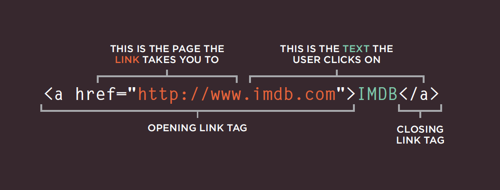

# **HTML Links, JS Functions, and Intro to CSS Layout**

## **Links**
> -  Creating links between pages
> -  Linking to other sites
> -  Email links

## Types of links::

1. Links from one website to another 
2. Links from one page to another on the same website
3. Links from one part of a web page to another part of the same page 
4. Links that open in a new browser window
5. Links that start up your email program and address a new email to someone

> ## Links are created using the `<a>` element. Users can click on anything between the opening `<a>` tag and the closing `</a>` tag. You specify which page you want to link to using the href attribute.

&nbsp;

## **Linking to Other Sites**

## `<a>`

> Links are created using the `<a>` element which has an attribute called href.

> The value of the href attribute is the page that
you want people to go to when they click on the link.

## **Linking to Other Pages on the Same Site**

`<a>`

> When you are linking to other pages within the same site, you do not need to specify the domain name in the URL. You can use a shorthand known as a relative URL.

## **Email Links**

`mailto:`

> To create a link that starts up the user's email program and addresses an email to a specified email address, you use the `<a>`
element. However, this time the value of the href attribute starts with `mailto:` and is followed by the email address you want the email to be sent to.

## **Opening Links in a New Window**

`target`
> If you want a link to open in a new window, you can use the target attribute on the opening `<a>` tag. The value of this attribute should be `_blank`.

## **Linking to a Specific Part of the Same Page**

&nbsp;

&nbsp;

# **Layout**

> - Controlling the position of elements
> - Creating site layouts
> - Designing for different sized screens

## **Normal Flow**
## *position:static*

> In normal flow, each block-level element sits on top of the next one.

&nbsp;

## **Relative Positioning**

## *position:relative*
> Relative positioning moves an element in relation to where it would have been in normal flow.

&nbsp;

## **Absolute Positioning**

## *position:absolute*
> When the position property is given a value of absolute, the box is taken out of normal flow and no longer affects the position of other elements on the page. (They act like it is not there.)

## **Fixed Positioning**
## *position:fixed*
>Fixed positioning is a type of absolute positioning that requires the position property to have a value of fixed.

## **Overlapping Elements**
## *z-index*
>When you use relative, fixed, or absolute positioning, boxes can overlap. If boxes do overlap, the elements that appear later in the HTML code sit on top of those that are earlier in the page.

## **Floating Elements**
## *float*
>The `float` property allows you to take an element in normal flow and place it as far to the left or right of the containing element as possible.

## **Clearing Floats**
## *clear*
> The clear property allows you to say that no element (within the same containing element) should touch the left or righthand sides of a box. It can take the following values:

## **Multiple Style Sheets**
## *@import*
&nbsp;
> Some web page authors split up their CSS style rules into separate style sheets. For example, they might use one style sheet to control the layout and another to control fonts, colors and so on.

## **Multiple Style Sheets**
## *link*
> Here you can see the other technique for including multiple style sheets. Inside the `<head>` element is a separate `<link>` element for each style sheet.

&nbsp;

&nbsp;

## **Summary**

## *LAYOUT*

- `
` elements are often used as containing elements to group together sections of a page.

- Browsers display pages in normal flow unless you
specify relative, absolute, or fixed positioning.
- The float property moves content to the left or right
of the page and can be used to create multi-column
layouts. (Floated items require a defined width.)
- Pages can be fixed width or liquid (stretchy) layouts.
- Designers keep pages within 960-1000 pixels wide,
and indicate what the site is about within the top 600
pixels (to demonstrate its relevance without scrolling).
-  Grids help create professional and flexible designs.
-  CSS Frameworks provide rules for common tasks.
-  You can include multiple CSS files in one page.