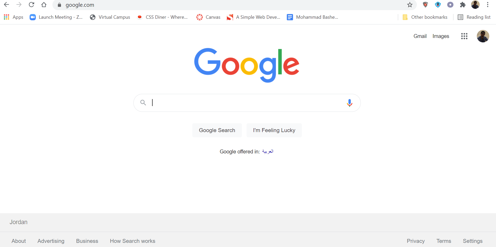

# **Forms and JS Events**

## **FORMS**
> - How to collect information from visitors
> - Different kinds of form controls
> - New HTML5 form controls

## Why Forms?

- ### The best known form on the web is probably the search box that sits right in the middle of Google's homepage.

&nbsp;

## **Form Structure**

## `<form>`
> Form controls live inside a `<form>` element. This element should always carry the action attribute and will usually have a method and id attribute too.

## `action`
> Every `<form>` element requires an action attribute. Its value is the URL for the page on the server that will receive the information in the form when it is submitted.

## `method`
> Forms can be sent using one

&nbsp;

## **Text Input**

## `<input>`

<input>

> The `<input>` element is used to create several different form controls. The value of the type attribute determines what kind of input they will be creating.

`type="text"` 
>When the type attribute has a value of text, it creates a singleline text input.

`name`

> When users enter information into a form, the server needs to know which form control each piece of data was entered into.

&nbsp;

## **Password Input**

`<input>`
<input>

`type="password"`

When the type attribute has
a value of password it creates
a text box that acts just like a
single-line text input, except
the characters are blocked out.
They are hidden in this way so
that if someone is looking over
the user's shoulder, they cannot
see sensitive data such as
passwords.

`name`
> The name attribute indicates
the name of the password input,
which is sent to the server with
the password the user enters.

`size, maxlength`
> It can also carry the size and
maxlength attributes like the
the single-line text input.

&nbsp;

## **Text Area**

`<textarea>`

> The `<textarea>` element
is used to create a mutli-line
text input. Unlike other input
elements this is not an empty
element. It should therefore have
an opening and a closing tag.

&nbsp;

## **Radio Button**

## `<input>`
<input>

## `type="radio"`

### Radio buttons allow users to pick just one of a number of options.

## `name`

> The name attribute is sent to
the server with the value of the
option the user selects. When
a question provides users with
options for answers in the form
of radio buttons, the value of
the name attribute should be the
same for all of the radio buttons
used to answer that question.

## `value`

> The value attribute indicates
the value that is sent to the
server for the selected option.
The value of each of the buttons
in a group should be different
(so that the server knows which
option the user has selected).

## `checked`

> The checked attribute can be
used to indicate which value (if
any) should be selected when
the page loads. The value of this
attribute is checked.

&nbsp;

## **Check Box**

`<input>`

`type="checkbox"`
> Checkboxes allow users to select
(and unselect) one or more
options in answer to a question.
name
The name attribute is sent to
the server with the value of the
option(s) the user selects. When
a question provides users with
options for answers in the form
of checkboxes, the value of the
name attribute should be the
same for all of the buttons that
answer that question.

`value`

> The value attribute indicates
the value sent to the server if this
checkbox is checked.

`checked`

> The checked attribute indicates
that this box should be checked
when the page loads. If used, its
value should be checked

&nbsp;

## **Drop Down List Box**

## `<select>`

> A drop down list box (also
known as a select box) allows
users to select one option from a
drop down list.

> The `<select>` element is used
to create a drop down list box. It
contains two or more `<option>`
elements.

## `name`

> The name attribute indicates the
name of the form control being
sent to the server, along with the
value the user selected.

## `<option>`

> The `<option>` element is used
to specify the options that the
user can select from. The words
between the opening `<option>`
and closing `</option>` tags will
be shown to the user in the drop
down box.

## `value`

> The `<option>` element uses the
value attribute to indicate the
value that is sent to the server
along with the name of the
control if this option is selected

&nbsp;

## **Multiple Select Box**

## `<select>`

## `size`
> You can turn a drop down select
box into a box that shows more
than one option by adding the
size attribute. Its value should
be the number of options you
want to show at once. In the
example you can see that three
of the four options are shown.

## `multiple`

> You can allow users to select
multiple options from this list by
adding the multiple attribute
with a value of multiple.

&nbsp;

## **File Input Box**

`<input>`

> If you want to allow users to
upload a file (for example an
image, video, mp3, or a PDF),
you will need to use a file input
box.

## `type="file"`
> This type of input creates a
box that looks like a text input
followed by a browse button.
When the user clicks on the
browse button, a window opens
up that allows them to select a
file from their computer to be
uploaded to the website.

&nbsp;

## **Submot Button**

## `<input>`

## `type="submit"`

> The submit button is used to
send a form to the server.

## `name`
> It can use a name attribute but it
does not need to have one.

## `value`
> The value attribute is used to
control the text that appears
on a button. It is a good idea to
specify the words you want to
appear on a button because the
default value of buttons on some
browsers is ‘Submit query’ and
this might not be appropriate for
all kinds of form.

&nbsp;

## **Image Button**

## `<input>`

## `type="image"`

> If you want to use an image for
the submit button, you can give
the type attribute a value of
image. The src, width, height,
and alt attributes work just
like they do when used with the
`` element.

&nbsp;

## **Button & Hidden Controls**

## `<button>`

> The `<button>` element was
introduced to allow users more
control over how their buttons
appear, and to allow other
elements to appear inside the
button.

> This means that you can
combine text and images
between the opening `<button>`
tag and closing `</button>` tag.

## `<input>`

## `type="hidden"`

> This example also shows a
hidden form control. These form
controls are not shown on the
page (although you can see them
if you use the View Source option
in the browser).

&nbsp;

## **Labelling Form Controls**

## `<label>`

> When introducing form controls,
the code was kept simple by
indicating the purpose of each
one in text next to it. However,
each form control should have
its own `<label>` element as this
makes the form accessible to
vision-impaired users.

### The `<label>` element can be used in two ways. It can:

1. Wrap around both the text description and the form input

2. Be kept separate from the form control and use the for attribute to indicate which form ontrol it is a label for.

&nbsp;

## **Grouping Form Elements**

## `<fieldset>`

> You can group related form
controls together inside the
`<fieldset>` element. This is
particularly helpful for longer
forms.

> Most browsers will show the
fieldset with a line around
the edge to show how they are
related. The appearance of these
lines can be adjusted using CSS.

## `<legend>`

> The `<legend>` element can
come directly after the opening
`<fieldset>` tag and contains a
caption which helps identify the
purpose of that group of form
controls.

&nbsp;

## **HTML 5: Date Input**

## `type="date"`

> If you are asking the user for a
date, you can use an `<input>`
element and give the type
attribute a value of date.
This will create a date input in
browsers that support the new
HMTL5 input types

&nbsp;

## **HTML 5: Email & URL Input**

## `type="email"`

> If you ask a user for an email
address, you can use the email
input. Browsers that support
HTML5 validation will check
that the user has provided
information in the correct format
of an email address

## `type="url"`

> A URL input can be used when
you are asking a user for a web
page address. Browsers that
support HTML5 validation will
check that the user has provided
information in the format of
a URL.

&nbsp;

## **HTML 5: Email Search Input**

## `type="search"`

> If you want to create a single
line text box for search queries,
HTML5 provides a special
search input

&nbsp;

&nbsp;
# **Lists, Tables and Forms**

> - Specifying bullet point styles
> - Adding borders and backgrounds to tables
> - Changing the appearance of form elements

# Summary

## LISTS , TAB LES AND FORMS

1. List markers can be given different appearances
using the list-style-type and list-style image
properties.

2. Table cells can have different borders and spacing in
different browsers, but there are properties you can
use to control them and make them more consistent.
 
3. Forms are easier to use if the form controls are
vertically aligned using CSS.

4. Forms benefit from styles that make them feel more interactive.
