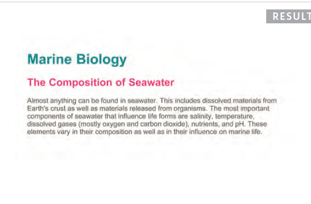
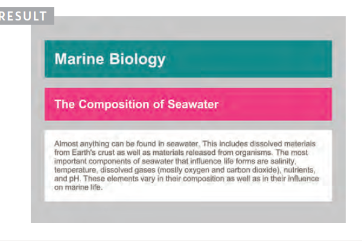

# Design web pages with CSS

## Introducing CSS
-  What CSS does
-  How CSS works
-  Rules, properties, and values

### Make your web pages more attractive, controlling the design of them using CSS.

### Thinking Inside the Box.

 >#### The key to understanding how CSS works is to imagine that there is an invisible box around every HTML element.

 Imagin box
 

#### CSS Associates Style rules with HTML elements
> hese rules govern
how the content of specified elements should be displayed. A CSS rule contains two parts: a `selector` and a `declaration.`

#### CSS Properties Affect How El ements Are Displayed
> CSS declarations sit inside curly brackets and each is made up of two parts: a `property` and a `value`, separated by a colon.

## COLOR
- How to specify colors
- Color terminology and contrast
- Background color

### Foreground Color
    color
>#### The color property allows you to specify the color of text inside an element. You can specify any color in CSS in one of three ways:
1. **RGB Values**
    >p {
color: rgb(100,100,90);}
2. **HEX Codes**
    >h2 {
color: #ee3e80;}
3. **Color Names**
    >h1 {
color: DarkCyan;}

### Background Color
    background-color

 1. **RGB Values**
    >body {
background-color: rgb(200,200,200);}

2. **HEX Codes**
    >h2 {
background-color: #ee3e80;}

3. **Color Names**
    >h1 {
background-color: DarkCyan;}

    >p {
background-color: white;} 

