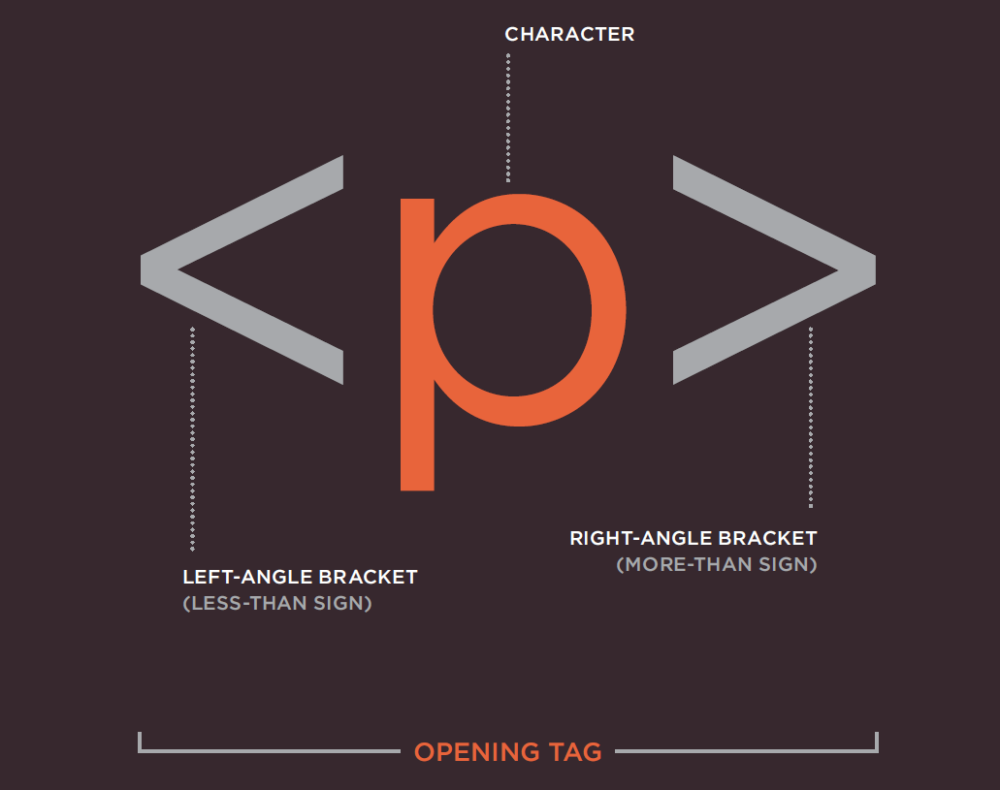
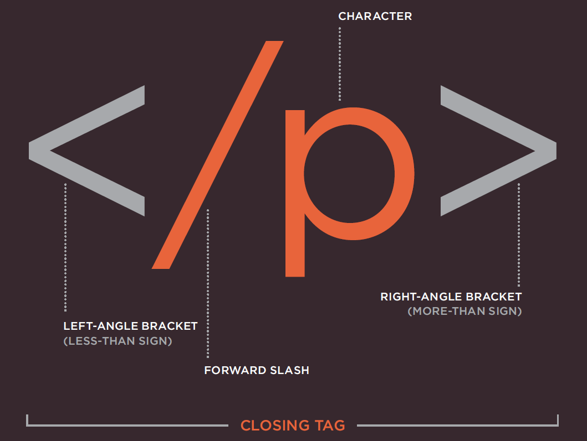
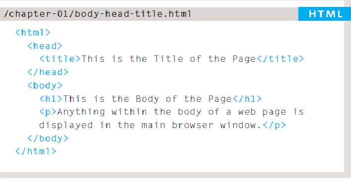
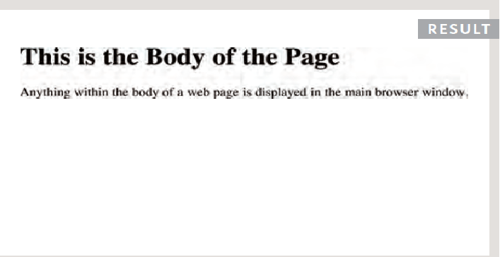
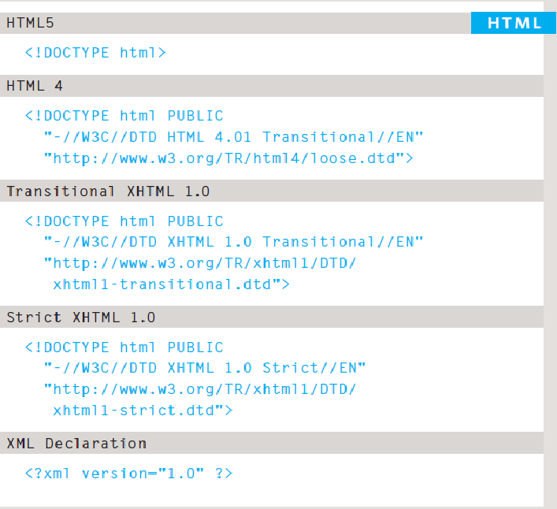

# **The Duckett HTML book:**

## In order to learn about creating web pages, this book is divided into three sections:

1. ## **HTML**
> - First chapter looking at how HTML is used to
create web pages.
3. ## **CSS**
> - This section starts with a chapter that explains how CSS uses rules to enable you to control the styling and layout of web pages.
4. ## **Practical**
> - End up with some helpful information that will assist you in building better websites.

____________________________________________________

____________________________________________________

# **Structure** 
## **HTML Describes the Structure of Pages**

#### This example explains how we see the web page and how the HTML code was written to display this.   
Note that the **HTML** code is in **blue**, and the **text** you see on screen is in **black.**

| **HTML** | **Text** |
| - | - |
|   |   | 

### The HTML code (in blue) is made up of characters that live inside angled brackets — these are called HTML elements. 
> Elements are usually made up of two tags: an opening tag and a closing tag.
____________________________________________________
____________________________________________________
____________________________________________________

# A Closer Look at Tags

| **Opening Tag** | **Closing Tag** |
| - | - |
|   |   | 
____________________________________________________
____________________________________________________

# Body, Head & Title

# `<body>`

> Everything inside this element is shown inside the main browser window.

# `<head>`
> Before the `<body>` element you will often see a `<head>` element. This contains information about the page

# `<title>`
> The contents of the `<title>` element are either shown in the top of the browser, above where you usually type in the URL of the page you want to visit, or on the tab for that page.

| **HTML** | **RESULTS** |
| - | - |
|   |   | 

____________________________________________________

____________________________________________________

# **Extra Markup**

>  - Specifying different versions of HTML
>  - Identifying and grouping elements
>  - Comments, meta information and iframes

## **The Evolution of HTML**

> Since the web was first created, there have been several different versions of HTML.

1. HTML 4
    > Released 1997
2. XHTML 1.0
    > Released 2000    
3. HTML5
    > Re leased 2000    

## **DOCTYPES**

>  Because there have been several versions of HTML, each web page should begin with a DOCTYPE declaration to tell a browser which version of HTML the page is using.

## **Comments in HTML**
> `<!-- -->`

> If you want to add a comment to your code that will not be visible in the user's browser, you can add the text between these characters:

> `<!-- comment goes here -->`

## **ID Attribute**
> Every HTML element can carry the id attribute. It is used to uniquely identify that element from other elements on the page.

> `
` This is a quote `
`

## **Class Attribute**
> Every HTML element can also carry a class attribute. 
>The id and class attributes allow you to identify particular elements.

> `
`Your Important paraghraph `
`

## **Grouping Text & Elements Inline**
> The `
` and `` elements allow you to group block-level and inline elements together.

## **IFrames**
>  `<iframes>` cut windows into your web pages through which other pages can be displayed.

## **Information About Your Pages**
> The `<meta>` tag allows you to supply all kinds of information about your web page.

## **Escape Characters**
>  Escape characters are used to include special
characters in your pages such as <, >, and ©.

____________________________________________________
____________________________________________________
____________________________________________________

# **HTML5 Layout**

> -  HTML5 layout elements
>  -  How old browsers understand new elements
>  -  Styling HTML5 layout elements with CSS

## **Headers & Footers `<header>` `<footer>`**

> The `<header>` and `<footer>` elements can be used for:
> - The main header or footer that appears at the top or bottom of every page on the site.
> - A header or footer for an individual `<article>` or `<section>` within the page.

## **Navigation `<nav>`**

> The `<nav>` element is used to contain the major navigational blocks on the site such as the primary site navigation.

## **Articles `<article>`**

> The `<article>` element acts as a container for any section of a page that could stand alone and potentially be syndicated. 

## **Asides `<aside>`**

> The `<aside>` element has two purposes, depending on whether it is inside an `<article>` element or not.
 > - When the `<aside>` element is used inside an `<article>` element, it should contain information that is related to the article but not essential to its overall meaning.
 > - When the `<aside>` element is used outside of an `<article>` element, it acts as a container for content that is related to the entire page.

 ## **Sections `<section>`**
 
 > The `<section>` element groups related content together, and typically each section would have its own heading.

 ## **Heading Groups `<hgroup>`**
 > The purpose of the `<hgroup>` element is to group together a set of one or more `<h1>` through `<h6>` elements so that they are treated as one single heading.

 ## **Sectioning El ements `
`**
 > the `
` element will remain an important way to group together related elements, because you should not be using these new elements that you have just met for purposes other than those explicitly stated.

 ______________________________________________________________________________________________________
 ___________________________________________________

 # **Process & Design**

 > - How to approach building a site.
 > - Understanding your audience and their needs
 >  - How to present information visitors want to see

## **HTML & CSS Process an Design**

#### **Process that you can use when you are creating a new website.**

#### Things to consider when deciding to build a website:
>   1. Who is the Site For?  Target Audience:
        >- Individuals or companies?

> 2. Why People Visit YOUR Website:
   > - General or Specific goal? personl of proffessional?

> 3. What Your Visitors are Trying to Achieve?

> 4.  What Information Your Visitors Need:

> 5. How Of ten People Will Visit Your Site?

> 6. Site Map: the foundation of high quality SEO

> 7. WireFrames: simple sketch of the key information

> 8. Getting your message across using design:
   > - Content
   > - Prioritizing
   > - Organizing
   > - Visual Hierarchy
   > - grouping
   > - Similarity

   _________________________________________________
   _________________________________________________
   _________________________________________________

   
# **Programming with JavaScript**

## **How Javascript Makes Web Pages More Interactive?**
> 1.  Access Content
> 2.  Modify Content
> 3.  Program Rules
> 4.  React To Events

### Exaples:
 > - SlidesShows
 > - Forms

## **The ABC of Programming**
> - Script and how to create one
> - How Computer fit in
> - How to write a script for a web page

### To write a script you need to first state your goal and then list the tasks that need to be completed in order to achieve it.

> `A Script is a series of instuctions that a computer can follow to achieve a goal.`

> 1.  Define the goal
> 2.  Design the script
> 3.  Code each step

