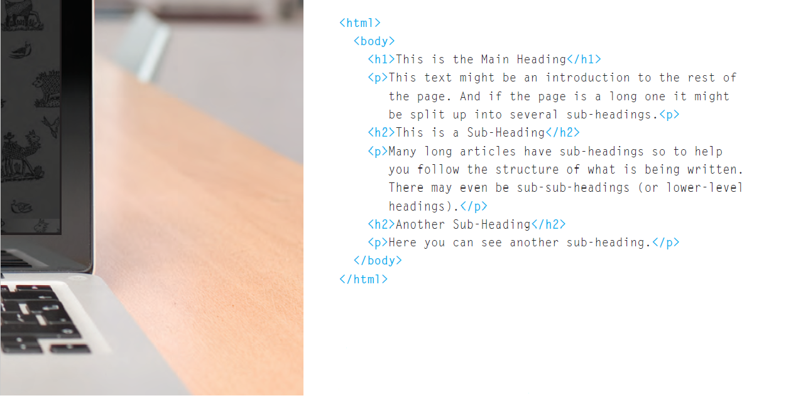
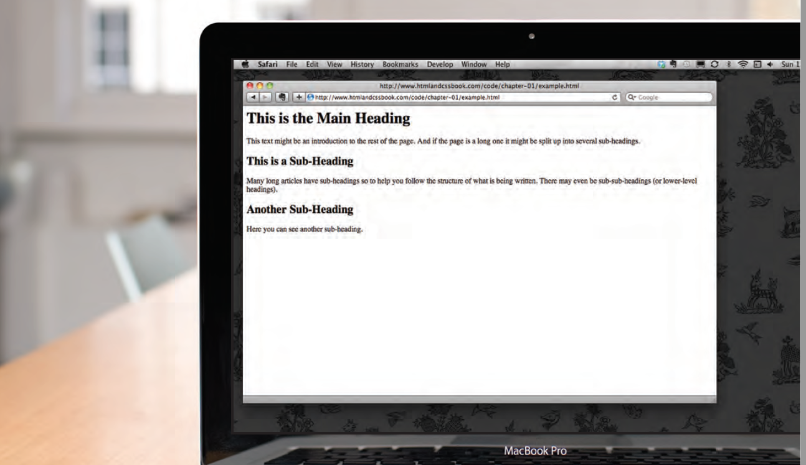

# **The Duckett HTML book:**

## In order to learn about creating web pages, this book is divided into three sections:

1. ## **HTML**
> - First chapter looking at how HTML is used to
create web pages.
3. ## **CSS**
> - This section starts with a chapter that explains how CSS uses rules to enable you to control the styling and layout of web pages.
4. ## **Practical**
> - End up with some helpful information that will assist you in building better websites.

____________________________________________________

____________________________________________________

# **Structure** 
## **HTML Describes the Structure of Pages**

#### This example explains how we see the web page and how the HTML code was written to display this.   
Note that the **HTML** code is in **blue**, and the **text** you see on screen is in **black.**

|  | |
| - | - |
|  |  | 

>  

>  