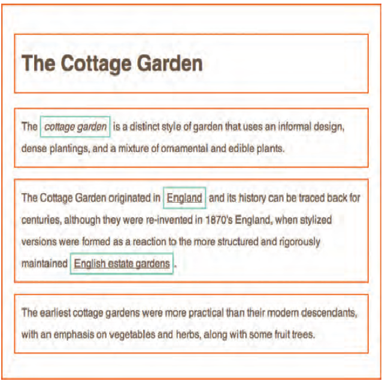
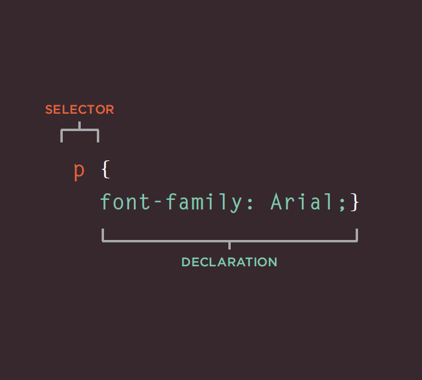
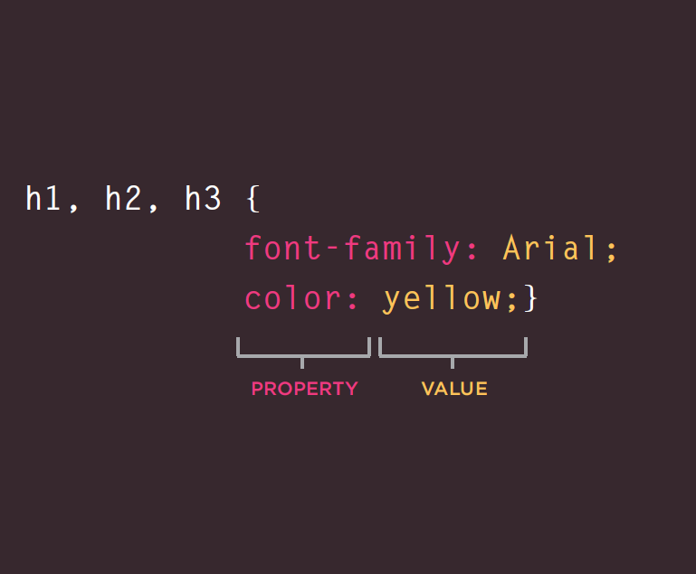

#  ***The Duckett HTML book:***
## **Design and Build Websites**
## **"TEXT"**

> - Headings and paragraphs
> - Bold, italic, emphasis
> - Structural and semantic markup

&nbsp;  

- ## Structural markup: 
> the elements that you can use to describe both headings and paragraphs.

- ## Semantic markup: 
> which provides extra information; such as where emphasis is placed in a sentence, that something
you have written is a quotation (and who said it), the meaning of acronyms, and so on.  

&nbsp;

&nbsp;

# **Structural markup:**

## **1. Headings**

# `<h1>` 
## `<h2>`
### `<h3>`
#### `<h4>`
##### `<h5>`
###### `<h6>`

| HTML | Results |
| ---- | ------- |
| `<h1>This is a Main Heading</h1>` | <h1>This is a Main Heading</h1> |
| `<h2>This is a Level 2 Heading</h2>` |<h2>This is a Level 2 Heading</h2> |
| `<h3>This is a Level 3 Heading</h3`> | <h3>This is a Level 3 Heading</h3> |
| `<h4>This is a Level 4 Heading</h4>` | <h4>This is a Level 4 Heading</h4> |
| `<h5>This is a Level 5 Heading</h5>` | <h5>This is a Level 5 Heading</h5> |
| `<h6>This is a Level 6 Heading</h6>` | <h6>This is a Level 6 Heading</h6> |  

&nbsp;

&nbsp;

## **2. Paragraphs**

## `
`
> To create a paragraph, surround the words that make up the paragraph with an opening `
` tag and closing `
` tag.

 By default, a browser will show
each paragraph on a new line
with some space between it and
any subsequent paragraphs.

&nbsp;

## **3. Bold & Italic**

## `<b>`
> By enclosing words in the tags
`<b> and </b>`  we can make
characters appear bold.  
For example: `<b> Bold </b>` will appear <b> Bold </b>

## `<i>`
> By enclosing words in the tags
`<i> and </i>` we can make
characters appear italic.  
For example: `<i> italic </i>` will appear <i> italic </i>

&nbsp;

## **4. Superscript & Subscript**

## ``
> The `` element is used
to contain characters that
should be superscript such
as the suffixes of dates or
mathematical concepts like
raising a number to a power such
as `22` will appear 22.    

## ``
> The `` element is used to
contain characters that should
be subscript. It is commonly
used with foot notes or chemical
formulas such as `H20.` will appear H20.

&nbsp;

## **5. White Space**

> When the browser comes across
two or more spaces next to each
other, it only displays one space.
Similarly if it comes across a line
break, it treats that as a single
space too. This is known as
**white space collapsing.**

Ex:  &nbsp;&nbsp; `
The moon is`   &nbsp; &nbsp;&nbsp;&nbsp;&nbsp;&nbsp;&nbsp;&nbsp;&nbsp;&nbsp;&nbsp;&nbsp;&nbsp;&nbsp;&nbsp;&nbsp;&nbsp;&nbsp;&nbsp;&nbsp;&nbsp;&nbsp;&nbsp;&nbsp;&nbsp;&nbsp;&nbsp;&nbsp;&nbsp;&nbsp;     `drifting away from Earth.
`

 Results: The moon is drifting away from Earth.

&nbsp;

## **6. Line Breaks & Horizontal Rules**

## ` `
> if you wanted
to add a line break inside the
middle of a paragraph you can
use the line break tag ` `.

Ex: `
`The Earth` `gets one hundred tons heavier`
`

Results: 
The Earth gets one hundred tons heavier

## `
`
> To create a break between
themes ___ you can add a
horizontal rule between sections
using the `
` tag.

Ex: `
`

Results: 

# **Semantic Markup:**

> Text elements that are not intended to affect the
structure of your web pages, but they do add extra information to the
pages

&nbsp;

## **1. Strong & Emphasis**

## `<strong>`
> `<strong>`
element indicates that its
content has strong importance.

EX: `
` `<strong>`Beware:`</strong>` Pickpockets operate in
this area.`
`

 
Results: <strong>Beware:</strong> Pickpockets operate in
this area.

## `<em>` 
> The `<em>` element indicates
emphasis that subtly changes
the meaning of a sentence.

 Ex: `
` I `<em>`think`</em>` Ivy was the first.`
`

  `
` I think `<em>`Ivy`</em>` was the first.`
`

  `
` I think Ivy was the `<em>`first`</em>`. `
`

  Results: 
I <em>think</em> Ivy was the first.

I think <em>Ivy</em> was the first.

I think Ivy was the <em>first</em>.

&nbsp;

## **2. Quotations**

## `<blockquote>`
> The `<blockquote>` element is
used for longer quotes that take
up an entire paragraph.

## `<q>`
> The `<q>` element is used for
shorter quotes that sit within
a paragraph. 

Ex: `<q>double quotations</q>`

Results: <q>double quotations</q>

&nbsp;

## **3. Abbreviations & Acronyms**

## `<abbr>`
> If you use an abbreviation or
an acronym, then the `<abbr>`
element can be used. A title
attribute on the opening tag is
used to specify the full term.

&nbsp;

## **4. Citations & Definitions**

## `<cite>`

## `<dfn>`

&nbsp;

## **5. Author Details**

## `<address>`

&nbsp;

## **6. Changes to Content**

## `<ins>`
## `<del>`
> `
`It was the `<del>`worst`</del>` `<ins>`best`</ins>` idea
she had ever had.`
`

Results: 
> 
It was the <del>worst</del> <ins>best</ins> idea she had ever had.

## `<s>`
> Ex: `
`Laptop computer:`
`

> `
` `<s>`Was $995`</s>` `
`

> `
`Now only $375 `
`

Results: 

Laptop computer:

<s>Was $995</s>

Now only $375

&nbsp;

&nbsp;

#  ***Introducing CSS***

> - What CSS does
> -  How CSS works
> -  Rules, properties, and values

## &nbsp;

## **Make your web pages more attractive, controlling the design of them using CSS.**

## Thinking Inside the Box.

 >#### The key to understanding how CSS works is to imagine that there is an invisible box around every HTML element.

 **Imagin box**
 

## &nbsp;

## **CSS Associates Style rules with HTML elements**
> hese rules govern
how the content of specified elements should be displayed. A CSS rule contains two parts: a `selector` and a `declaration.`

## &nbsp;

## **CSS Properties Affect How El ements Are Displayed**
> CSS declarations sit inside curly brackets and each is made up of two parts: a `property` and a `value`, separated by a colon.

## &nbsp;

## **Using External CSS**
## `<link>`
> The <link> element can be used
in an HTML document to tell the
browser where to find the CSS
file used to style the page.

`href`
> This specifies the path to the
CSS file (which is often placed in
a folder called css or styles).

`type`
> This attribute specifies the type
of document being linked to. The
value should be text/css.

`rel`
> This specifies the relationship
between the HTML page and
the file it is linked to. The value
should be stylesheet when
linking to a CSS file.

## &nbsp;

## **Using Internal CSS**
`<style>`
> can also include CSS rules
within an HTML page by placing
them inside a `<style>` element,
which usually sits inside the
`<head>` element of the page.

## &nbsp;

## **CSS Selectors**
> There are many different types
of CSS selector that allow you to
target rules to specific elements
in an HTML document.
The following link will redirect to **w3schools.com** page contains almost all selectors with description:
[CSS Selectors](https://www.w3schools.com/cssref/css_selectors.asp)

&nbsp;

&nbsp;

#  ***Programming with JavaScript***

## **How Javascript Makes Web Pages More Interactive?**
> 1.  Access Content
> 2.  Modify Content
> 3.  Program Rules
> 4.  React To Events

### Exaples:
> - SlidesShows
> - Forms

### The ABC of Programming
> - Script and how to create one
> - How Computer fit in
> - How to write a script for a web page

#### A Script is a series of instuctions that a computer can follow to achieve a goal.

### **To write a script**
 
### you need to first state your goal and then list the tasks that need to be completed in order to achieve it.

> 1.  Define the goal
> 2.  Design the script
> 3.  Code each step

&nbsp;

&nbsp;

#  ***Programming with JavaScript***

## **Decisions and Loops**

## **Comparison Operators:**

Evaluate a situation by comparing one value in the script to what you expect it might be. The result will be a Boolean: True or false.

- Is equal to **==** compares two values to check if they are the same

- Is not equal to **!=** compares two values to check if they are not the same

- Strict equal to **===** compares two values to verify that both the value and the data type are the same

- Strict not equal to **!==** compares two values to verify that both the value and the data type are different

- Greater than: 8 **>** 3 returns true

- Less than: 5 **<** 9 returns true

- Greater than or equal to **>=**

- Less than or equal to **<=**

_____________________________________________________________
## **Logical Operators**
The operators used to return the result of multiple comparison operators

**((5 < 12) || (8 >= 2))**

- Logical AND **&&**

- Logical OR **||**

- Logical NOT **!**

______________________________________________________________

## **Loops**
A loop is block of code that will keep running as long as the condition is true. The most common types of loops are:

- **For loop**; used when the code has to run specific number of times. It uses a counter as a condition

- **While loop**; used when the number of repetitions is unknown

- **Do while loop**; the fundamental difference between this loop and while loop is that the code will run at least once even if the condition evaluates to false

**  A for loop consists of variable initialization, condition, and update.

***Example***

Loop through the indices of an array to collect the car names from the cars array:

>var cars = ["BMW", "Volvo", "Saab", "Ford"];
v/ar text = "";
var i = 0;
while (i < cars.length) {
  text += cars[i] + " ";
  i++;
}   

